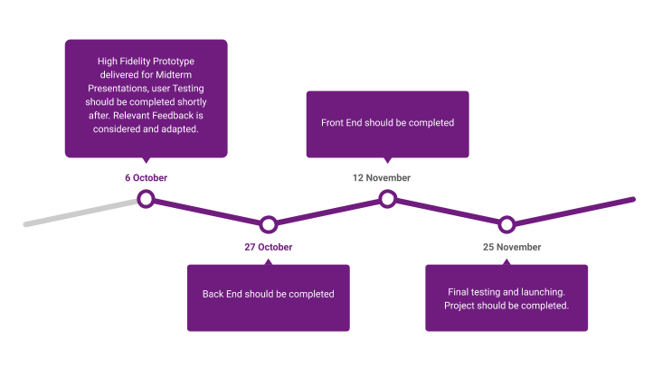

# Midterm Presentation

## Project Name: GoodVibes .com
  New social media website. I believe social media is a way to share knowledge, this includes but not limited to the ability to manage, search, exchange, and update information. 
        GoodVibes wishes to develop a new social media platform to enable users to host their own content through posts, blogs, or groups. The platform will enable users to connect all of their content creation sites and have a one-stop spot for their audience to experience everything.

## Specifications/Requirements

### Feature list (Product Requirements)

- Easy onboarding/registration
- 	Example | Login | Sign up
-	Creator Dashboard
-	Personalization Screen
-	Sharing life data
-	Ability to view Analytics
-	Ability to cross post from many different platforms (?)

### Functional Requirements

#### Website basics

User can register 

User can search

Users can post

Users can repost

Users can follow other users

Users can follow other blogs 

Users can join other groups	

Users can report

Users can create blogs

Users can create groups

Users can delete posts, blogs, and profiles

#### Other Important Features

-	Registration. The main requirements are simplicity (exclude unnecessary steps), reliability (make sure user data is protected), and multi-variance (offer several options to register).

-	Profile. Creating a user account is the next logical step after registration. The profile includes information about the user and also offers access to his photo albums, personal information, and more.

-	Posts. Of course, the main emphasis is on the ability to publish posts. That is, the user should be able to share news, interesting information, and other things with their friends.

-	Full-featured Search for groups, brands, people. Any social network website should help people in finding each other. 

-	Friendship. A user must be able to send a friend request or just follow the account they like in order to see its news in their news feed.

-	News Feed. The news feed we've already mentioned allows the user to see what is happening in the lives of his friends and people he is following.

-	The Wall (located near Profile). Now it's about the news of the user himself. On the wall, he can place links to favorite articles, write posts, create photo, text, and video galleries/albums.

-	Chat. Users should have a chance to chat both in a private mode and in groups.

-	File Transfer. Sometimes when communicating a user needs to share a file with his conversational partner. Social network features have to include the ability to transfer files as simple as possible, just in the process of online conversation.

-	Bookmarks. Facebook provides a user with the possibility to save articles and posts “for later,” so that he can find the material he liked without any trouble.

-	Notifications, another essential feature of almost any application.

-	User Status. Some users don’t mind clarifying their status in order to notify others about certain changes in their lives. This may relate to personal life (married, divorced, in love, etc.), work (let's say, you've started to work in a new place), and similar things.

-	Analytics. Such a feature is extremely necessary for both users and you, as the owner of the resource. Users will especially need analytical tools if they want to promote their products or services through your site.

-	Admin Access. The feature is aimed at those who will manage the site, block unreliable users, and perform other administrative functions.

### Non-Functional Requirements

-	Usability- Most users will access social sites through smartphones. Responsive UI/UX is a must.
-	Reliability- Ideally this should rely on one central computer/infrastructure. Peer 2 Peer model?
-	Security- Requires some correspondence between profile and real person (through phone/email) non-anonymous. It also has to be protected and secured from fake accounts (Use captchas and verifications codes). Encryption/signature keys? 
-	Availability-All the time :0
-	Portability- Should be able to use on web, web on the phone, and apps
-	Operability-Design should be simple, but can allow users to create complicated profiles/groups/blogs.
-	Maintainability- For me, hopefully by the end of the semester.
-	Flexibility- Should allow users to restrict access to their accounts (public vs private) with a press of a button.
-	Efficiency-This needs to be responsive, clicks and actions should happen within 0.5 seconds of each other.

## Design Documents

<https://docs.google.com/drawings/d/1z_EgLZ_q5u6P1Qd9chTGi4QfDqT_vjdDuRPPaNQqR5s/edit?usp=sharing>

## Timeline & Estimate

-	6 October- High Fidelity Prototype delivered for Midterm Presentations, user Testing should be completed shortly after. Relevant Feedback is considered and adapted.
-	27 October – Back End should be completed
-	17 November – Front End should be completed
-	25 November- Final testing and launching. Project should be completed.

## Progress

